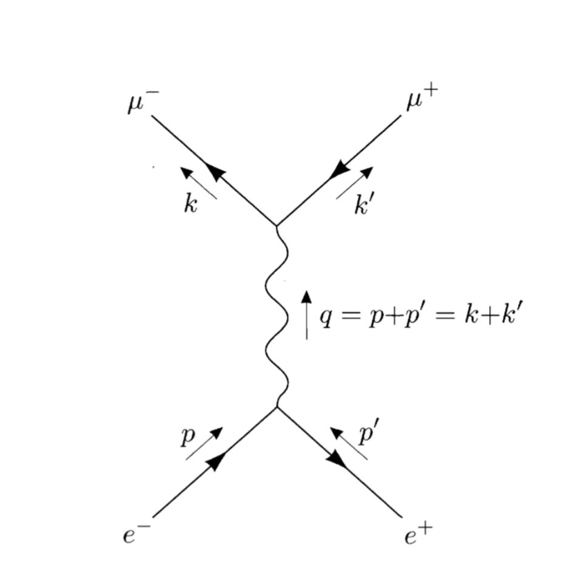

##### Download

+ [Paper](internship.pdf)

---

##### Abstract

This report, written for an internship under Dr. Ishtiaq Ahmed of National Center of Physics, calculates the unpolarized cross section for a QED process. We start by introducing the necessary concepts, including Dirac spinors and Feynman rules. Following that, we will compute the matrix element and perform a detailed evaluation of the trace. Finally, we will derive the cross section, averaging over spins, and simplifying the expression step by step. The QED process under consideration involves the scattering of an electron and positron into a pair of heavier leptons. The matrix element involves spinor contractions and gamma matrix identities, which we will evaluate explicitly.

---

##### Figure 1: Electron-Positron Scattering Feynman Diagram

---

##### Citation

---

##### Related material

+ [QFT Notes by David Tong](https://www.damtp.cam.ac.uk/user/tong/qft/qft.pdf)
