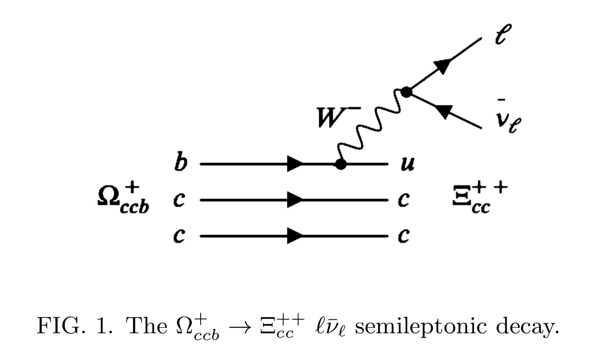

---

##### Download

+ [Paper](fyp.pdf)
+ [Code and data](https://github.com/pmichaillat/feru)

---

##### Abstract

This report investigates the weak semileptonic decay of Ω+ccb − → Ξ++ cc ℓ¯νℓ, where a theoretically predicted triply heavy omega baryon of spin 1/2 decays into an observed doubly heavy Xi baryon with spin 1/2. We develop the theoretical formalism required to explain this phenomenon and briefly outline the methodology of QCD sum rules and relevant form factors. We plot the form factors and calculate the exclusive widths across all three lepton channels. Finally, we discuss how our predicitons may help the present and future experiments in the search for doubly heavy and triply baryons.

---

##### Figure 6: Some Uses For Olive Oil

---

##### Related material

+ [Presentation slides](presentation.pdf)
