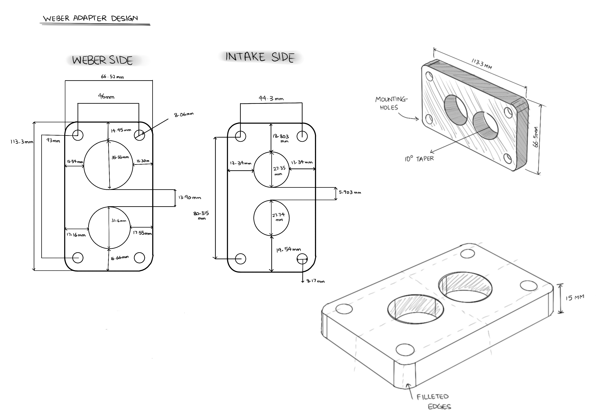

---

##### Download

+ [Report](weber.pdf)
+ [Adapter Plate 3D Model](https://drive.google.com/file/d/1F9rkEl1AN0TRvPXgUSeZY3cjY00S6Ep0/view?usp=sharing)

---

##### Abstract

This study investigates airflow limitations in a Toyota 7K engine equipped with a stock 4K carburetor and intake manifold. Calculations of volumetric demand and pressure losses demonstrate that the 4K carburetor imposes excessive restriction at higher RPM, justifying the adoption of a Weber 32/36 DGEV carburetor. The focus then shifts to the adapter plate required to mount the Weber, where flow losses are analyzed using contraction coefficients and loss factors for both sharp-step and tapered transitions. Results show that a tapered adapter significantly reduces pressure drop compared to a sharp step, particularly for the secondary bore. The findings establish both the inadequacy of the factory setup and the importance of adapter geometry in realizing the Weber’s potential.

---

##### Figure 2: Hand Drawn Diagram Matching Weber with Stock Intake Manifold

---

---

##### Related material

+ [Carburetors by Raso Enterprises](https://www.rasoenterprises.com/index.php/engine-technology/40-carburetion/16-carburetion)
+ [Volumetric Flow Rate by HpWizard](https://hpwizard.com/volumetric-flow-rate.html)
